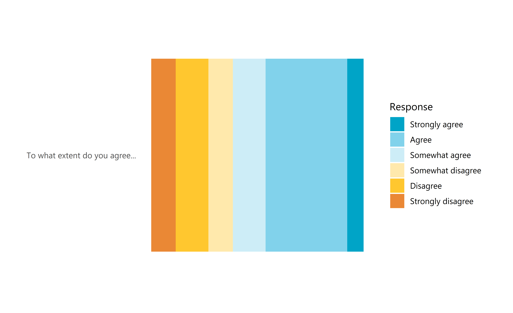
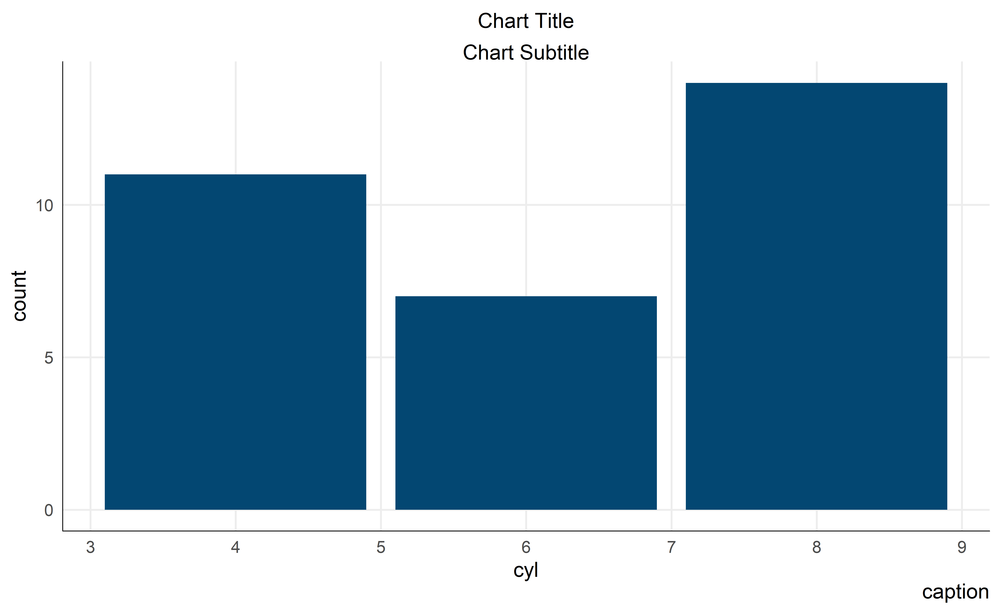
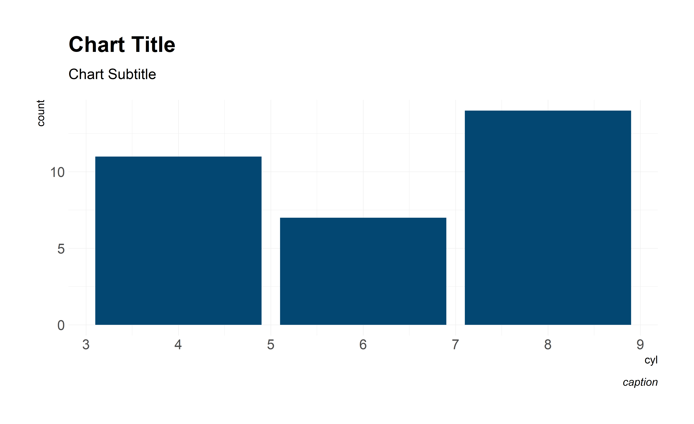
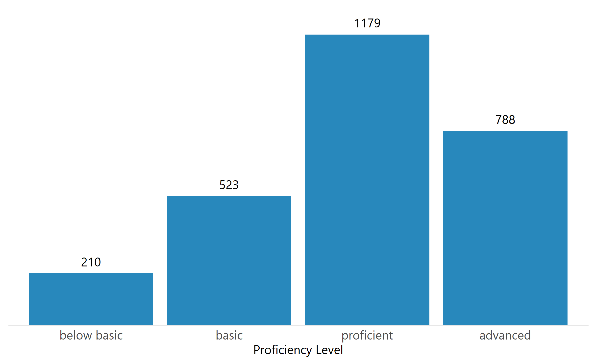
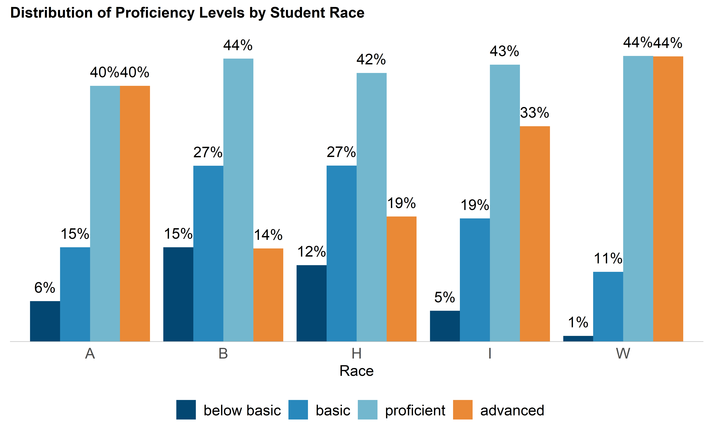

Using the tntpr package
================
2019-06-04

  - [About](#about)
  - [Package summary](#package-summary)
  - [Installing the package](#installing-the-package)
  - [Usage](#usage)
      - [Reporting templates](#reporting-templates)
      - [Setting up repositories and
        subfolders](#setting-up-repositories-and-subfolders)
      - [TNTP colors](#tntp-colors)
      - [TNTP themes for ggplot2](#tntp-themes-for-ggplot2)
      - [Chart building](#chart-building)
      - [Survey tools](#survey-tools)
      - [Data management](#data-management)

## About

The `tntpr` package makes data science at TNTP easier and more accurate
by supplying tools that are needed for common TNTP analyses.

## Package summary

Some of the highlights of the package include:

  - A TNTP-themed RMarkdown template, for starting a new analysis with a
    shell that can already generate a TNTP-themed .docx report
  - Functions for initializing a new repository or project folder with
    TNTP-standard directories and documentation
  - TNTP-specific ggplot2 themes and color palettes
  - Survey analysis tools
  - Wrappers for quickly making typical TNTP-style charts (e.g., bar
    chart of the distribution of one variable, grouped by a second)
  - Education-specific data management functions (e.g., `date_to_SY()`
    to convert continuous hire dates into school years using a specified
    cutoff date), and a built-in fake student achievement dataset to
    play with called `wisc`.

## Installing the package

This package is not on CRAN, and probably will not ever be. You’ll need
to install this package from its GitHub repository. You can add this to
the top of your analysis script:

    # install tntpr if you don't already have it, then load it
    library(devtools) # for install_github()
    if(!require("tntpr")) install_github("tntp/tntpr")
    library(tntpr)

Once installed, you can update the package with `update_tntpr()`.

## Usage

### Reporting templates

Start your analysis with a good-looking .docx file as output, right off
the bat. Right now we have just a single TNTP template, “Data Memo”, but
it can be adapted and improved and if we have other common needs (a
different set of headings?) those can easily be separate templates.

**To access templates once you’ve installed the tntpr package:** go to
`File` -\> `New File` -\> `R Markdown` -\> `From Template`. You’ll see a
choice “Data Memo” from the tntpr package. Just specify the document’s
file name and the directory you want it in (probably a subfolder of a
Bitbucket repository) and you’re off\!

A file `tntp-style-file.docx` will be copied into that directory; leave
it there. That provides the TNTP .docx stylings when you re-knit your R
Markdown document.

### Setting up repositories and subfolders

This saves time getting started with a new analysis and encourages use
of common file storage conventions and documentation that make work more
browsable and transparent.

**Directory conventions**

TNTP’s Bitbucket directory structure is a single repository per client
or region, with subdirectories in the repository corresponding to
specific analysis projects. For example:

>   - \<City \#1\>
>       - <City abbreviation> \<Project \#1 name\>
>       - <City abbreviation> \<Project \#2 name\>
>       - <City abbreviation> \<Project \#3 name\>
>   - \<City or Region \#2\>
>       - …

**Usage**

After creating a new, empty repo in Bitbucket and cloning it, run
`setup_repo` to initialize it. This will create a subfolder as well, in
which you’ll conduct an analysis project.

If the repository already exists, and you just want to begin a new
analysis project, create the new subdirectory with `setup_subdirectory`.

Both functions take the same arguments, used to setup the project
subfolder and its README:  
\- *subfolder*: what the name of the subdirectory should be, e.g.,
“xyz\_instructional\_audit”  
\- *proj\_name*: the full name of the analysis project, e.g., “XYZ
Public Schools Equity Study”. Appears in the README.  
\- *analyst\_name*: the analyst(s) working on this project. Appears in
the README.

`setup_repo` will also add a `.Rproj` RProject file, `.gitignore` file,
and create a README.Md file for the main repository.

### TNTP colors

You can access the official TNTP-branded colors using `palette_tntp()`.
This will return a vector with hex code for our colors:

``` r
palette_tntp("dark_blue", "orange", "light_gray")
```

    ## [1] "#034772" "#EA8936" "#C1C2C4"

Or you can select a specific TNTP palette (`"default"`,
`"colors_tntp_classic"`, `"likert_4pt"`, `"likert_5pt"`, or
`"likert_6pt"`) with `palette_tntp_scales` and return a vector with hex
codes for that TNTP palette.

``` r
palette_tntp_scales(palette = "likert_5pt")
```

    ##  likert_7  likert_6  likert_4  likert_2  likert_1 
    ## "#00a4c7" "#81d2eb" "#e6e7e7" "#ffc72f" "#ea8835"

You can use these scale palettes as fill or color aesthetics in ggplot
with `scale_fill_tntp` and `scale_color_tntp`.

``` r
data.frame(question = "To what extent do you agree...", 
           response = c(rep("Strongly disagree", 3), 
                        rep("Disagree", 4), 
                        rep("Somewhat disagree", 3), 
                        rep("Somewhat agree", 4),  
                        rep("Agree", 10), 
                        rep("Strongly agree", 2))) %>% 
  mutate(response = response %>% factor(levels = rev(c("Strongly disagree", 
                                                   "Disagree", 
                                                   "Somewhat disagree", 
                                                   "Somewhat agree",
                                                   "Agree", 
                                                   "Strongly agree")))) %>% 
  ggplot(aes(question, fill = response)) + 
    geom_bar(position = position_fill()) + 
    theme_tntp_2018(axis_text = "Y", grid = FALSE) + 
    labs(x = NULL, y = NULL, 
         fill = "Response") + 
    coord_flip() + 
    scale_fill_tntp(palette = "likert_6pt")
```



``` r
wisc %>% 
  mutate(race = case_when(race == "A" ~ "Asian", 
                          race == "B" ~ "Black/African American", 
                          race == "H" ~ "Hispanic/Lation",
                          race == "I" ~ "Amercian Indian", 
                          race == "W" ~ "White")) %>% 
  ggplot(aes(readSS, mathSS, color = race %>% as.factor())) + 
    geom_point() + 
    theme_tntp_2018() + 
    labs(x = "Reading Scale Score",
         y = "Math Scale Score", 
         color = "Race/Ethnicity of Student") + 
    scale_color_tntp() # default palette is "default"
```


### TNTP themes for ggplot2

Add `+ theme_tntp()` or `+ theme_tntp_2018()` to your ggplot2 calls to
format a chart in a common TNTP style. For instance, this will use the
Segoe UI font that is standard at TNTP.

``` r
ggplot(mtcars, aes(x = cyl)) +
  geom_bar(fill = palette_tntp("dark_blue")) + 
  labs(title = "Chart Title", 
     subtitle = "Chart Subtitle", 
     caption = "caption") + 
  theme_tntp()
```



``` r
ggplot(mtcars, aes(x = cyl)) +
  geom_bar(fill = palette_tntp("dark_blue")) + 
  labs(title = "Chart Title", 
       subtitle = "Chart Subtitle", 
       caption = "caption") + 
  theme_tntp_2018()
```



### Chart building

#### Custom charting functions

So far there’s the function `bar_chart_counts`, for making a TNTP-style
bar chart of a distribution. It automates some tedious aspects of
chart-making that R is slow at, like text labels showing %s. These
charts are deck-ready, faster than Excel.

Here are examples with the built-in `wisc` data set (of fake Wisconsin
test data):

``` r
bar_chart_counts(wisc, proflvl, var_label = "Proficiency Level")
```



``` r
bar_chart_counts(wisc,
                 race,
                 proflvl,
                 var_label = "Race",
                 labels    = "pct",
                 title     = "Distribution of Proficiency Levels by Student Race",
                 digits    = 0)
```



The function has lots of customization options, see `?bar_chart_counts`
for more.

### Survey tools

These functions are for working with data as it’s exported from
SurveyMonkey in XLS or CSV format.

Recode check-all-that-apply questions, then tabulate them.

``` r
x <- data.frame( # 4th person didn't respond at all
  unrelated = 1:5,
  q1_1 = c("a", "a", "a", NA, NA),
  q1_2 = c("b", "b", NA, NA, NA),
  q1_3 = c(NA, NA, "c", NA, NA),
  q1_other = c(NA, "something else", NA, NA, "nope it's a different thing")
)
library(dplyr) # for the %>% pipe
x %>%
  check_all_recode(q1_1:q1_other) %>%
  check_all_count(q1_1:q1_other)
```

    ## Warning in check_all_q_text_to_label(cols_of_interest): column 4 has
    ## multiple values besides NA; not sure which is the question text. Guessing
    ## this an "Other (please specify)" column.

    ##  response n percent
    ##         a 3    0.75
    ##         b 2    0.50
    ##         c 1    0.25
    ##     Other 2    0.50

You can use any of the `dplyr::select()` helpers to identify the
columns:

``` r
x %>%
  check_all_recode(contains("q1")) %>%
  check_all_count(contains("q1"))
```

    ## Warning in check_all_q_text_to_label(cols_of_interest): column 4 has
    ## multiple values besides NA; not sure which is the question text. Guessing
    ## this an "Other (please specify)" column.

    ##  response n percent
    ##         a 3    0.75
    ##         b 2    0.50
    ##         c 1    0.25
    ##     Other 2    0.50

Convert a vector to a yes/no binary with
`recode_to_binary`:

``` r
x <- c("strongly agree", "agree", "somewhat disagree", "strongly disagree")
recode_to_binary(x, label_matched = "Top-2", label_unmatched = "Not Top-2")
```

    ## [1] Top-2     Top-2     Not Top-2 Not Top-2
    ## Levels: Top-2 Not Top-2

### Data management

#### Functions already in tntpr

`date_to_SY`: cuts continuous dates, like hire dates, into discrete
school years, at a specified cut-off date. For instance, here are some
hire dates, split into their school year hiring seasons based on a
September 1st
cut-off:

``` r
hire_dates <- c(as.Date("2015-08-31"), as.Date("2015-10-20"), as.Date("2016-08-08"),
                as.Date("2016-08-31"), as.Date("2016-09-15"))
date_to_sy(hire_dates, last_day_of_sy = as.Date("2000-09-01")) # the year doesn't matter in this argument
```

    ## [1] "2014 - 2015" "2015 - 2016" "2015 - 2016" "2015 - 2016" "2016 - 2017"

`factorize_df`: examines each column in a data.frame; when it finds a
column composed solely of the values provided to the  argument it
updates them to be factor variables, with levels in the order
provided.

``` r
rec_levels <- c("Screen Out", "Recommend with Reservations", "Recommend", "Recommend without Hesitation", "Highly Recommend")

ratings <- tibble(id = 1:100, 
                  first_rating = sample(rec_levels, 100, replace = TRUE), 
                  second_rating = sample(rec_levels, 100, replace = TRUE))
ratings <- ratings %>% 
  factorize_df(lvls = c("Screen Out", "Recommend with Reservations", "Recommend", "Recommend without Hesitation", "Highly Recommend"))
```

    ## Transformed these columns: 
    ##  *  first_rating, 
    ## *  second_rating

``` r
ratings$first_rating %>% is.factor()
```

    ## [1] TRUE

``` r
ratings$first_rating %>% levels()
```

    ## [1] "Screen Out"                   "Recommend with Reservations" 
    ## [3] "Recommend"                    "Recommend without Hesitation"
    ## [5] "Highly Recommend"

#### Possible upcoming additions

We can incorporate other functions that have been written but not yet
standardized for the package. E.g., converting survey responses to top-2
agree:

``` r
convert_to_top_2_agree <- function(x, custom_vals = NULL){
  if(is.null(custom_vals)){
    custom_vals <- c("strongly agree", "agree", "highly satisfied", "extremely satisfied",
                     "satisfied", "very confident", "confident")
    x <- tolower(x)
  }
  if_else(is.na(x), as.character(NA),
          if_else(x %in% custom_vals, "Top-2 Agree", "Not in Top-2"))
}

# Usage:
convert_to_top_2_agree(c("Strongly agree", "Agree", "Somewhat agree", NA, NA, "Strongly disagree")) %>%
  tabyl
```

    ##             . n   percent valid_percent
    ##  Not in Top-2 2 0.3333333           0.5
    ##   Top-2 Agree 2 0.3333333           0.5
    ##          <NA> 2 0.3333333            NA

Or functions to discern teacher movement when comparison rosters and
studying retention and transfer patterns. This can be
simple:

``` r
# Write function to determine whether someone left the location the next year
left_campus <- function(first_year, second_year){
  if_else(is.na(first_year), NA,
         if_else(is.na(second_year), TRUE,
                if_else(first_year != second_year, TRUE, FALSE)))
}
```

Or complex:

``` r
# Formula for detailing yearly movement
yearly_movement <- function(first_year, second_year){
  case_when(
    is.na(first_year) & is.na(second_year) ~ "Not Present",
    is.na(first_year) & second_year == "Teacher" ~ "Joined as Teacher",
    is.na(first_year) & second_year == "Leader" ~ "Joined as Leader",
    is.na(first_year) & second_year == "Other" ~ "Joined as Other"
    ,
    first_year == "Teacher" & is.na(second_year) ~ "Teacher Left",
    first_year == "Leader" & is.na(second_year) ~ "Leader Left",
    first_year == "Other" & is.na(second_year) ~ "Other Left",
    
    first_year == "Teacher" & second_year == "Teacher" ~ "Remained Teacher",
    first_year == "Teacher" & second_year == "Leader" ~ "Teacher became Leader",
    first_year == "Teacher" & second_year == "Other" ~ "Teacher became Other",
    
    first_year == "Leader" & second_year == "Leader" ~ "Remained Leader",
    first_year == "Leader" & second_year == "Teacher" ~ "Leader became Teacher",
    first_year == "Leader" & second_year == "Other" ~ "Leader became Other",
   
    first_year == "Other" & second_year == "Teacher" ~ "Other became Teacher",
    first_year == "Other" & second_year == "Leader" ~ "Other became Leader",
    first_year == "Other" & second_year == "Other" ~ "Remained Other",
    TRUE ~ "bad formula!"
  )
}
```

Avoids a lot of scratching your head at nested `ifelse()` statements\!

*These data wrangling functions have not yet been incorporated into
tntpr, but easily could be - as could functions that handle any
recurring data cleaning task we face.*
