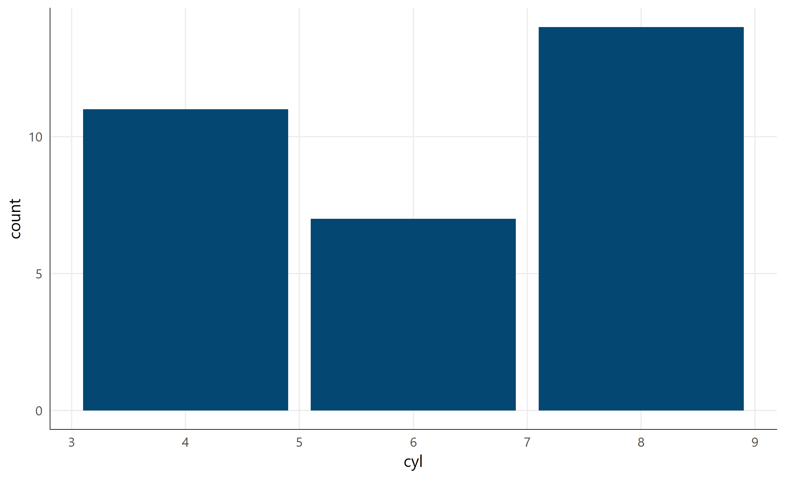
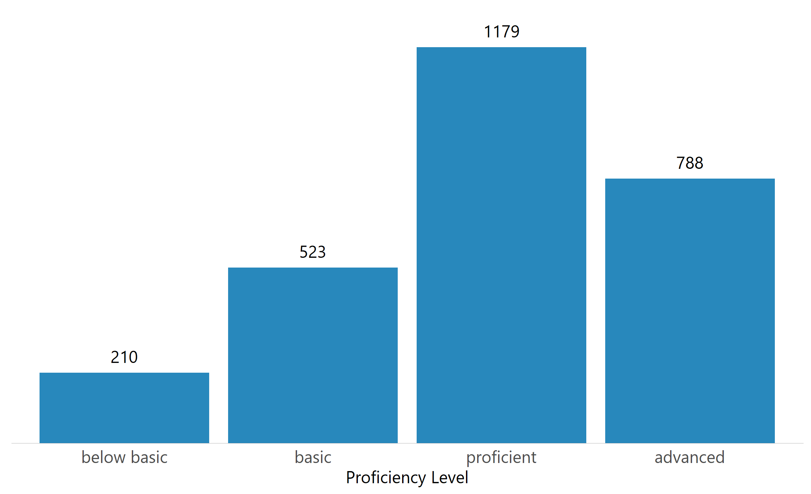
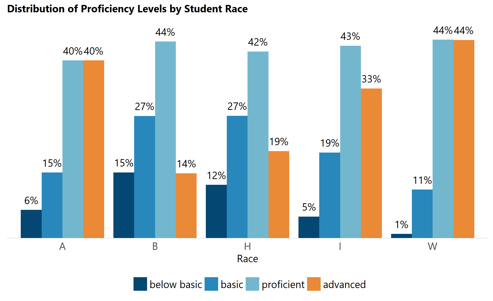

-   [About](#about)
-   [Package summary](#package-summary)
-   [Installing the package](#installing-the-package)
-   [Usage](#usage)
    -   [Reporting templates](#reporting-templates)
    -   [Chart styles](#chart-styles)
    -   [Survey tools](#survey-tools)
    -   [Chart building](#chart-building)
    -   [Data management](#data-management)

About
-----

The `tntpr` package makes data science at TNTP easier and more accurate
by supplying tools that are needed for common TNTP analyses. Because
this package serves just the TNTP analysis community, functions can be
tailored very specifically to our exact use cases.

Package summary
---------------

Some of the highlights of the package include:

-   TNTP-themed RMarkdown templates, for starting a new analysis with a
    shell that can already generate a TNTP-themed .docx report
-   TNTP-specific ggplot2 theme and color palette
-   Survey analysis tools
-   Wrappers for quickly making typical TNTP-style charts (e.g., bar
    chart of the distribution of one variable, grouped by a second)
-   Education-specific data management functions (e.g., `date_to_SY()`
    to convert continuous hire dates into school years using a specified
    cutoff date), and a built-in fake student achievement dataset to
    play with called `wisc`.

Installing the package
----------------------

This package is not on CRAN, and probably will not ever be. You’ll need
to install this package from its Bitbucket repository via `devtools`.

Install that package first with `install.packages("devtools")`.

Then you can add this to the top of your analysis script:

    # install tntpr if you don't already have it, then load it
    library(devtools) # for install_git()
    if(!require("tntpr")) install_git("https://tools.tntp.org/bitbucket/scm/ct/tntpr.git")
    library(tntpr)

This won’t check for updates, though. So for now, consider periodically
running the `install_git(...)` part anyway. Once it’s installed, you can
load it however you normally load packages, say with
`pacman::p_load(tntpr)`.

In the past, versions of devtools have had trouble installing from our
Bitbucket repo. Ping Sam if you’re having trouble with the above.

Usage
-----

### Reporting templates

Start your analysis with a good-looking .docx file as output, right off
the bat. Right now we have just a single TNTP template, “Data Memo”, but
it can be adapted and improved and if we have other common needs (a
different set of headings?) those can easily be separate templates.

**To access templates once you’ve installed the tntpr package:** go to
`File` -&gt; `New File` -&gt; `R Markdown` -&gt; `From Template`. You’ll
see a choice “Data Memo” from the tntpr package. Just specify the
document’s file name and the directory you want it in (ideally a
Bitbucket repository) and you’re off!

A file `tntp-style-file.docx` will be copied into that directory; leave
it there. That provides the TNTP .docx stylings when you re-knit your R
Markdown document.

### Chart styles

#### TNTP colors

You can access the official TNTP-branded colors using `palette_tntp()`.
This will return a vector with hex code for our colors:

    palette_tntp("dark_blue", "orange", "light_gray")

    ## [1] "#034772" "#EA8936" "#C1C2C4"

### Survey tools

These functions are for working with data as it’s exported from
SurveyMonkey in XLS or CSV format.

Recode check-all-that-apply questions, then tabulate them.

    x <- data.frame( # 4th person didn't respond at all
      unrelated = 1:5,
      q1_1 = c("a", "a", "a", NA, NA),
      q1_2 = c("b", "b", NA, NA, NA),
      q1_3 = c(NA, NA, "c", NA, NA),
      q1_other = c(NA, "something else", NA, NA, "nope it's a different thing")
    )
    library(dplyr) # for the %>% pipe
    x %>%
      check_all_recode(q1_1:q1_other) %>%
      check_all_count(q1_1:q1_other)

    ## Warning in check_all_q_text_to_label(cols_of_interest): column 4 has
    ## multiple values besides NA; not sure which is the question text. Guessing
    ## this an "Other (please specify)" column.

    ##   response n percent
    ## 1        a 3    0.75
    ## 2        b 2    0.50
    ## 3        c 1    0.25
    ## 4    Other 2    0.50

You can use any of the `dplyr::select()` helpers to identify the
columns:

    x %>%
      check_all_recode(contains("q1")) %>%
      check_all_count(contains("q1"))

    ## Warning in check_all_q_text_to_label(cols_of_interest): column 4 has
    ## multiple values besides NA; not sure which is the question text. Guessing
    ## this an "Other (please specify)" column.

    ##   response n percent
    ## 1        a 3    0.75
    ## 2        b 2    0.50
    ## 3        c 1    0.25
    ## 4    Other 2    0.50

Convert a vector to a yes/no binary with `recode_to_binary`:

    x <- c("strongly agree", "agree", "somewhat disagree", "strongly disagree")
    recode_to_binary(x, label_matched = "Top-2", label_unmatched = "Not Top-2")

    ## [1] Top-2     Top-2     Not Top-2 Not Top-2
    ## Levels: Top-2 Not Top-2

*This is a little clunky and can probably be improved.*

#### TNTP theme for ggplot2

Add `+ theme_tntp()` to your ggplot2 calls to format a chart in the
common TNTP style. For instance, this will use the Segoe UI font that is
standard at TNTP.

    ggplot(mtcars, aes(x = cyl)) +
      geom_bar(fill = palette_tntp("dark_blue")) +
      theme_tntp()

### Chart building

#### Custom charting functions

So far there’s the function `bar_chart_counts`, for making the
ubiquitous TNTP-style bar chart of a distribution. It automates some
tedious aspects of chart-making that R is slow at, like text labels
showing %s. These charts are deck-ready, faster than Excel.

Here are examples with the built-in `wisc` data set (of fake Wisconsin
test data):

    bar_chart_counts(wisc, proflvl, var_label = "Proficiency Level")

    bar_chart_counts(wisc,
                     race,
                     proflvl,
                     var_label = "Race",
                     labels    = "pct",
                     title     = "Distribution of Proficiency Levels by Student Race",
                     digits    = 0)

The function has lots of customization options, see
`?bar_chart_continuous` for more.

We hope to add a similar function for showing means.

### Data management

#### Functions already in tntpr

`date_to_SY`: cuts continuous dates, like hire dates, into discrete
school years, at a specified cut-off date. For instance, here are some
hire dates, split into their school year hiring seasons based on a
September 1st cut-off:

    hire_dates <- c(as.Date("2015-08-31"), as.Date("2015-10-20"), as.Date("2016-08-08"),
                    as.Date("2016-08-31"), as.Date("2016-09-15"))
    date_to_sy(hire_dates, last_day_of_sy = as.Date("2000-09-01")) # the year doesn't matter

    ## [1] "2014 - 2015" "2015 - 2016" "2015 - 2016" "2015 - 2016" "2016 - 2017"

#### Possible upcoming additions

We can incorporate other functions that have been written but not yet
standardized for the package. E.g., converting survey responses to top-2
agree:

    convert_to_top_2_agree <- function(x, custom_vals = NULL){
      if(is.null(custom_vals)){
        custom_vals <- c("strongly agree", "agree", "highly satisfied", "extremely satisfied",
                         "satisfied", "very confident", "confident")
        x <- tolower(x)
      }
      if_else(is.na(x), as.character(NA),
              if_else(x %in% custom_vals, "Top-2 Agree", "Not in Top-2"))
    }

    convert_to_top_2_agree(c("Strongly agree", "Agree", "Somewhat agree", NA, NA, "Strongly disagree")) %>%
      tabyl

    ##             . n   percent valid_percent
    ##  Not in Top-2 2 0.3333333           0.5
    ##   Top-2 Agree 2 0.3333333           0.5
    ##          <NA> 2 0.3333333            NA

Or functions to discern teacher movement when comparison rosters and
studying retention and transfer patterns. This can be simple:

    # Write function to determine whether someone left the location the next year
    left_campus <- function(first_year, second_year){
      if_else(is.na(first_year), NA,
             if_else(is.na(second_year), TRUE,
                    if_else(first_year != second_year, TRUE, FALSE)))
    }

Or complex:

    # From Noble St. contract, July 2016, Danielle Proulx
    # Formula for detailing yearly movement
    yearly_movement <- function(first_year, second_year){
      case_when(
        is.na(first_year) & is.na(second_year) ~ "Not Present",
        is.na(first_year) & second_year == "Teacher" ~ "Joined as Teacher",
        is.na(first_year) & second_year == "Leader" ~ "Joined as Leader",
        is.na(first_year) & second_year == "Other" ~ "Joined as Other"
        ,
        first_year == "Teacher" & is.na(second_year) ~ "Teacher Left",
        first_year == "Leader" & is.na(second_year) ~ "Leader Left",
        first_year == "Other" & is.na(second_year) ~ "Other Left",
        
        first_year == "Teacher" & second_year == "Teacher" ~ "Remained Teacher",
        first_year == "Teacher" & second_year == "Leader" ~ "Teacher became Leader",
        first_year == "Teacher" & second_year == "Other" ~ "Teacher became Other",
        
        first_year == "Leader" & second_year == "Leader" ~ "Remained Leader",
        first_year == "Leader" & second_year == "Teacher" ~ "Leader became Teacher",
        first_year == "Leader" & second_year == "Other" ~ "Leader became Other",
       
        first_year == "Other" & second_year == "Teacher" ~ "Other became Teacher",
        first_year == "Other" & second_year == "Leader" ~ "Other became Leader",
        first_year == "Other" & second_year == "Other" ~ "Remained Other",
        TRUE ~ "bad formula!!!"
      )
    }

Save yourself a lot of scratching your head with nested `ifelse()`
statements!

*These data wrangling functions have not yet been incorporated into
tntpr, but easily could be - as could functions that handle any
recurring data cleaning task we face.*
