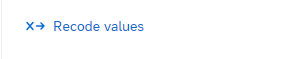
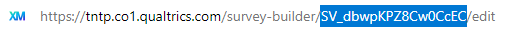

```{r, include = FALSE}
knitr::opts_chunk$set(
  collapse = TRUE,
  fig_caption = FALSE,
  comment = "#>"
)
```
## Introduction

This vignette is designed to showcase best practices for setting up, pulling, and processing Qualtrics data in R. There are *many* different ways to accomplish these tasks, but we will lay out a recommended workflow that we belive to be the simplest and most flexible. This document will go through the following big ideas:

1.  **Setup:** Installing the necessary packages
2.  **Building Surveys:** Best practices in Qualtrics for creating surveys in a way that will help you analyze efficiently
3.  **Qualtrics Authentication: ** How to get an API token from Qualtrics and safely store it in R.
4.  **Getting Data:** How to use the `qualtRics` package to pull survey data.
5.  **Analysis:** Some common methods of analysis, including helpful functions from `tntpr`
6.  **Advanced Tools:** A brief overview of the `QualtricsInR` and `httr2` packages and how they can be used to automate even more in Qualtrics.

## Setup

The main package you'll be using for interacting with Qualtrics is named `qualtRics` (get it?). We'll also be using some basic functionality from the tidyverse packages, and from `tntpr`. Make sure you've installed these packages first using `install.packages()` (or `devtools::install_github('tntp/tntpr')` for the `tntpr` package).

```{r warning = FALSE, message = FALSE}
library(qualtRics)
library(tntpr)

# NOTE: We are not simply loading `tidyverse` in this vignette due to how vignettes
# are built to create the documentation website. In other contexts, however, we
# would simply use `library(tidyverse)` instead of loading the following packages individually.
library(dplyr)
library(tidyr)
library(purrr)
library(forcats)
library(lubridate)
```

## Building Surveys

### General Survey-Building Advice

*What makes a good survey question? How long should my survey be? How do I deal with distribution lists? Authentication?*

These are all great questions, and they will **not** be answered in this vignette. For more guidance, check out the "Survey Resources" category in the Documents of the TNTP Data Analytics Sharepoint site. This vignette will focus only on the aspects of survey design that interact directly with R, specifically...

### Question Codes

When you create surveys in Qualtrics each question will come with a standard question code in the form `Q7` or `Q192`.


These question codes will eventually become the column headers of your data-frame in R, so we recommend setting them up in advance to be usable:

-   Follow tidyverse naming conventions (snake case, e.g. `styled_like_this`)
-   Avoid spaces and special characters (except for \_ and -)
-   Use standard prefixes or suffixes for questions you will want to group together in analysis. For example, using `id_name`, `id_school`, `id_district`, `id_email`, etc. allows you to easily pull all of those columns with the tidy-select statement `starts_with('id_')`

For simple multiple choice and text-entry questions, you'll only need to edit the main question code as seen in the image above. However for more complicated question types you may need to adjust the Recode Values, Variable Naming, or Question Export Tags. You can access these settings by clicking on the question and finding the Recode Values button under Question Behavior:



Here's a quick rundown of how each question type behaves with recode values:

- **Check all:** fill this out later...

Once your survey is built and ready to go, you'll want to get data from it (well, after you collect responses of course). You *could* download the data as a .csv and then import that into R, but with a little bit of time on setup you can make the process much easier by just pulling directly from the **Qualtrics API**. The first step to getting your data is to get set up with...

## Qualtrics Authentication

This section will cover:
1.  Getting a Qualtrics API Token
1.  Storing your token securely in R
1.  Accessing your token in R

### Qualtrics API Token

Follow these steps to get your API token:

1. Log in to the TNTP Qualtrics site
1. Click on your bubble in the top-right, and select "Account Settings"
1. Go to the "Qualtrics IDs" tab
1. Under the "API" heading click "Generate Token" and copy the resulting string of characters

### Storing Credentials in R

Your API Token should be treated and protected like a password. Just like you wouldn't write your computer password down on a post-it note next to your trackpad (you wouldn't do that, right?), you **should NOT** hard-code your token (or any other passwords / secrets) directly into your scripts, since they may be seen and used by other people.

```{r}
# BAD! DO NOT DO THIS!!!
api_token <- 'abcdefghijklmnopqrstuvwxyz'
```

Instead we're going to save our token in a local file called `.Renviron` (which lives in your home directory and is not synced by Github, Bitbucket, or Sharepoint), and then pull it in from there.

The qualtRics package provides an automated way to do this saving. Note that you should run the script below only one time and from the Console. **DON'T put it in your analysis script(s)** (otherwise you're defeating the whole point):

```{r, eval = FALSE}
# Run this ONCE from the console to save your credentials
qualtrics_api_credentials(
  api_key = "YOUR KEY HERE",
  base_url = "tntp.co1.qualtrics.com",
  install = TRUE
)
```

### Accessing Credentials in R

Once you've saved your credentials, you'll need to restart R (either close and re-open RStudio or run `.rs.restartR()`) and then you should be able to access your credentials using the `Sys.getenv()` command:

```{r, eval = FALSE}
Sys.getenv('QUALTRICS_API_KEY')
Sys.getenv('QUALTRICS_BASE_URL')
```

From now on, these environmental variables will be available every time you open R. You can use this same process to store other tokens or passwords:

```{r, eval = FALSE}
# Open the .Renviron file
usethis::edit_r_environ()

# Add any values you want to the file in the format below and then save the file
# MY_KEY_NAME = 'keyvalue'

# Restart R / RStudio

# Access variables from the .Renviron file
my_key <- Sys.getenv('MY_KEY_NAME')
```

Congrats! You've now securely saved your Qualtrics credentials, and you're ready to start pulling down survey data!

## Getting Data

### Survey ID
In addition to your survey data, you'll need the survey ID for the survey you are trying to pull. This ID will be in the form "SV_**********", and the easiest way to get it is by navigating to the survey in your browser and copying it from the URL bar:


You can also pull down all surveys you have access to using the `all_surveys()` function from `qualtRics`, and then filter that by name:
```{r, eval = FALSE}
surveys <- all_surveys()
surveys |> 
  filter(name == "FY24_tntpr_Example Survey")

```

Your survey ID is *not* a secret, so you can happily keep that value hard-coded at the top of your script

### Pulling Survey Data
Now that you have your authentication details saved in `.Renviron` and your survey id ready to go, it's time to pull a survey!

```{r, eval = FALSE}
survey_id <- 'SV_dbwpKPZ8Cw0CcEC'
survey <- fetch_survey(survey_id, force_request = TRUE)
```

It's worth noting a few of the useful optional arguments in `fetch_survey()` (one of which we used above):

-   `force_request = TRUE` by default qualtRics saves the survey data for the session and will use that data when you call `fetch_survey()` again for the same id. This argument forces a fresh pull, which is useful when you're testing a script or if you want to make sure you have the most up-to-date data.
-   `start_date` and `end_date` can be used to limit the responses pulled by `RecordedDate`
-   `include_metadata = NA` or `include_embedded = NA` can be used to exclude metadata or embedded data columns. You can also run them with a character vector to include only certain columns: `include_metadata = c('RecipientEmail', 'RecordedDate')`
-   `label = FALSE` Enabling this option will pull recode values instead of text (e.g. `6` instead of `Strongly Agree`)

# Pulling other data
There are a bunch of other functions within the qualtRics package to pull other types of data, including:

-   `fetch_description()` for full survey data, including survey flow, options, scoring, etc.
-   `fetch_distributions()` to pull distributions for a survey
-   `fetch_distribution_history()` to pull history for an individual distribution
-   `fetch_mailinglist()` to pull a mailing list by mailing list ID
-   `survey_questions()` to pull information on each question in a survey. Similar to the `column_map` that is downloaded by `fetch_survey()` by default.

## Analysis

## Advanced Tools
