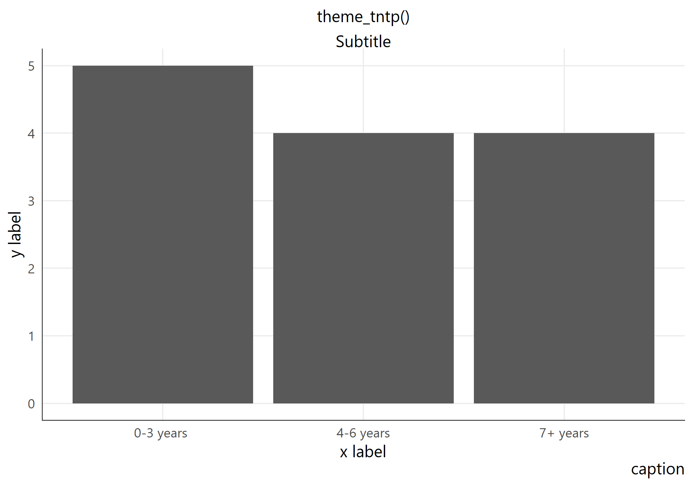
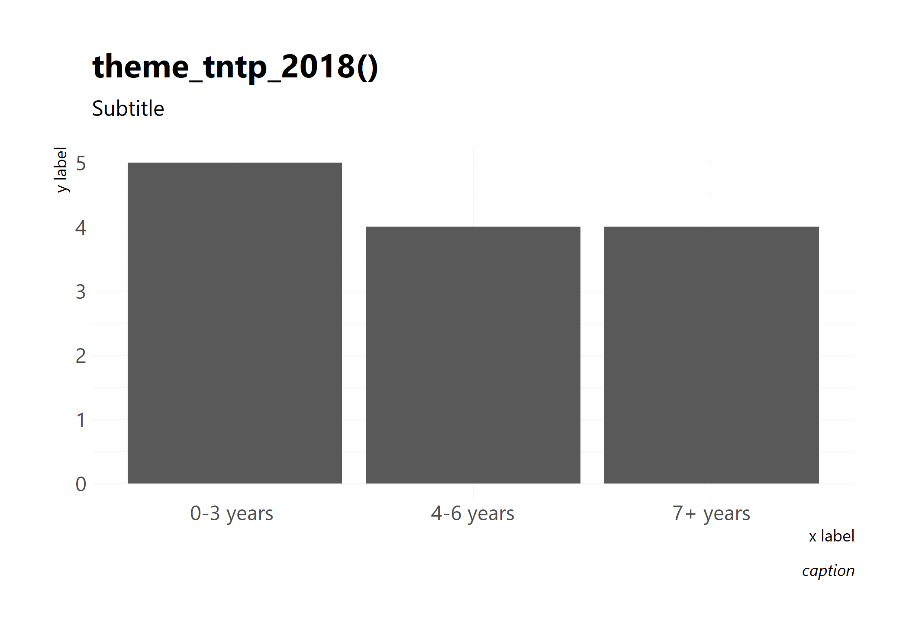
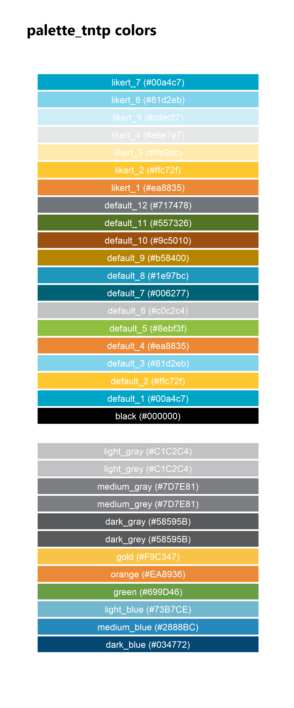
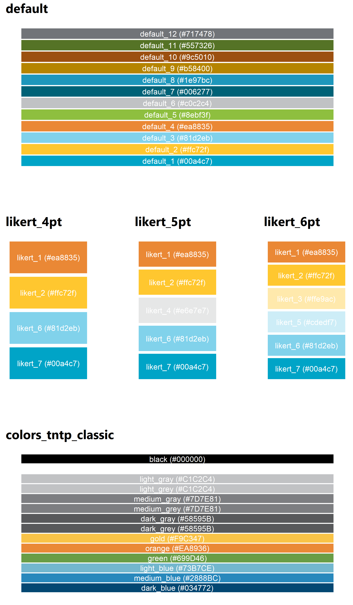
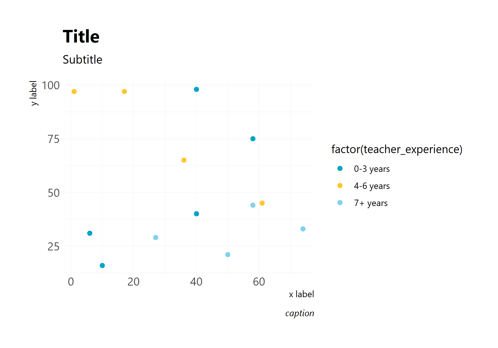
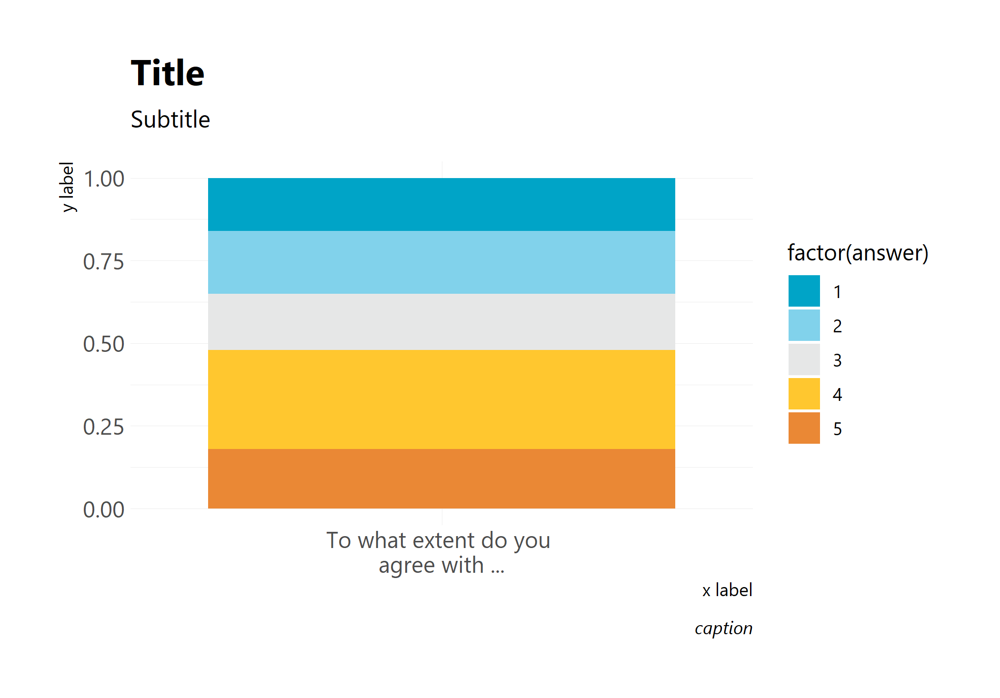

Creating TNTP-style ggplot2 Graphs
================
Generated 2019-03-28

### ggplot Themes

tntpr now has two ggplot2 themes; the classic `theme_tntp()`, and the
updated
`theme_tntp_2018()`.






### palette\_tntp() gives you access to TNTP-style colors:

You can still use palette\_tntp the way you used to…

``` r
palette_tntp("dark_blue")
#> [1] "#034772"
```

… but now you have a larger selection of
colors.



The `palette_tntp_scales()` function provides access to 5 TNTP color
scales:

– `"default"` (colors in the PPT and Word template),

– `"likert_4pt"`,`"likert_5pt"`, `"likert_6pt"`,and

– `colors_tntp_classic` (original `palette_tntp` colors from when this
package was created years
ago).



### `scale_fill_tntp()` and `scale_color_tntp()`

Supply TNTP-palette scales for filling and coloring.

``` r
performance_data %>%
  ggplot(aes(factor(teacher_experience), fill = factor(y1_performance_quartile))) +
    geom_bar(position = position_fill()) +
    labs(title = "Title",
         subtitle = "Subtitle",
         x = "x label",
         y = "y label",
         fill = "fill",
         caption = "caption") +
  theme_tntp_2018() +
  scale_fill_tntp()
```


``` r
performance_data %>% 
  ggplot(aes(x = y1_teacher_performance, y = y2_teacher_performance, color = factor(teacher_experience))) + 
    geom_point(size = 2) + 
    labs(title = "Title",
       subtitle = "Subtitle",
       x = "x label",
       y = "y label",
       fill = "fill",
       caption = "caption") + 
    theme_tntp_2018() + 
    scale_color_tntp()
```



You can specify which color palette you want to use.

``` r
survey_question %>%
  ggplot(aes(factor(question), fill = factor(answer))) +
  geom_bar(position = position_fill()) +
  labs(title = "Title",
       subtitle = "Subtitle",
       x = "x label",
       y = "y label",
       caption = "caption") +
  theme_tntp_2018() + 
  scale_fill_tntp(palette = "likert_5pt")
```


