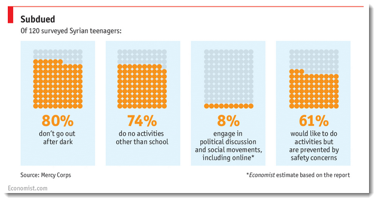
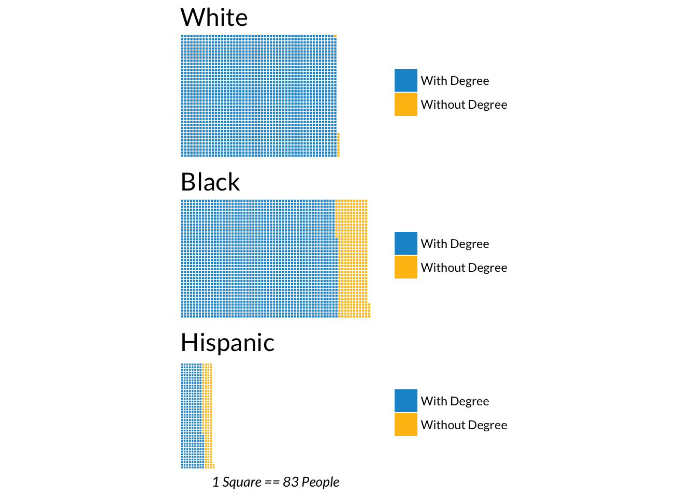
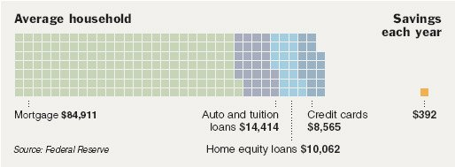
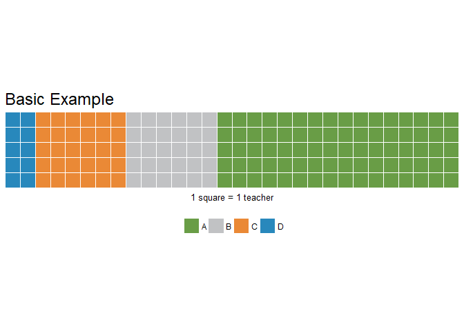
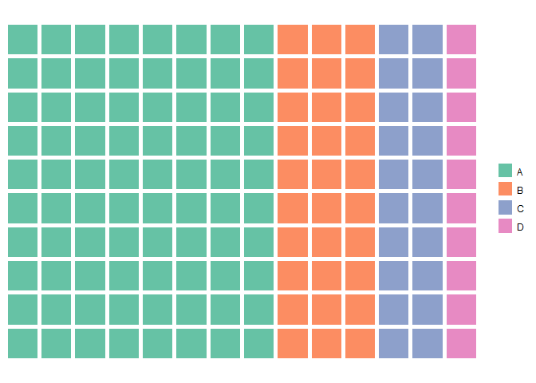
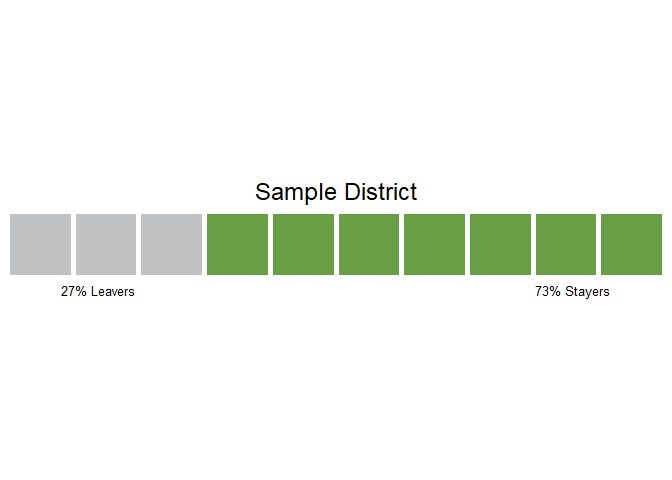
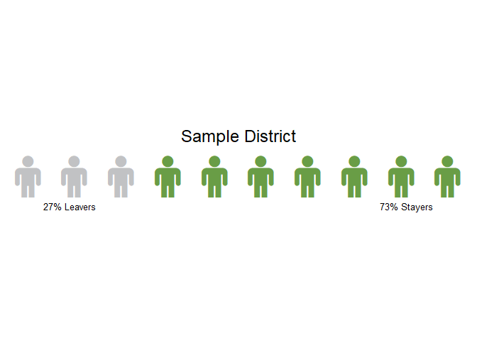

*** 
## What is a Waffle chart?

Square pie charts (a.k.a. waffle charts) can be used to communicate
parts of a whole for categorical quantities.

***
## Examples of Waffle Charts

[Economist](https://policyviz.com/hmv_post/waffle-charts/)



***
[Urban Institute](http://urbaninstitute.github.io/urban_R_theme/#waffle_chart__square_pie_chart)


***
[New York Times](http://graphics8.nytimes.com/images/2008/07/20/business/20debtgraphic.jpg)



***
## Set-up

As of 4/2018 the CRAN version of Waffle is still 0.7.0. We use the 0.9.0 version here so that we can 
use data frames to make a Waffle chart.


```r
## Note: CRAN Version 0.7.0 does not support data.frames (as of 2018-04-26)
# install.packages("waffle")
# library(waffle)

library(devtools)
install_github("hrbrmstr/waffle")

library(waffle)

packageVersion("waffle")
```

```
## [1] '0.9.0'
```

***
## Basic example


```r
parts <- c(80, 30, 30, 10)
waffle(parts, 
       rows = 5, # number of rows of blocks
       size = .5, # width of the separator between blocks (defaults to 2)
       colors = c(palette_tntp("green"), palette_tntp("light_grey"), 
                  palette_tntp("orange"), palette_tntp("medium_blue")),
       reverse = TRUE, # reverses the order of the data
       flip = FALSE, # flips x & y axes
       xlab = "1 square = 1 teacher", # text for below the chart
       title = "Basic Example", # chart title
       legend_pos = "bottom" # position of legend (can be alse be "none")
       )
```

<!-- -->

***
## Basic example using a data frame (Version 0.9.0 +)


```r
parts <- data.frame(
  names = LETTERS[1:4],
  vals = c(80, 30, 20, 10)
)
```


```r
parts
```

```
##   names vals
## 1     A   80
## 2     B   30
## 3     C   20
## 4     D   10
```


```r
waffle(parts)
```

<!-- -->

***
## Teacher Retention Waffle

***
Raw Data Frame


```r
source <- c("Sample District")
percent_attrition <- c(0.2664059)

raw_retention_df <- data_frame(source, percent_attrition)
```


```r
raw_retention_df
```

```
## # A tibble: 1 x 2
##   source          percent_attrition
##   <chr>                       <dbl>
## 1 Sample District             0.266
```


Clean Data Frame


```r
clean_retention_df <- raw_retention_df %>% 
                        mutate(# mutate number of Leavers_icons and Stayers_icons from the percent_attrition
                               Leavers_icons = round(percent_attrition, 1) * 10, 
                               Stayers_icons = 10 - Leavers_icons,
                               
                               # create labels
                               Leavers_percent = round(percent_attrition, 2) * 100, 
                               Stayers_percent = 100 - Leavers_percent, 
                                                 
                               Leavers_label = paste0(Leavers_percent, "% Leavers"),
                               Stayers_label = paste0(Stayers_percent, "% Stayers"),
                        )
```


```r
clean_retention_df
```

```
## # A tibble: 1 x 8
##   source      percent_attriti~ Leavers_icons Stayers_icons Leavers_percent
##   <chr>                  <dbl>         <dbl>         <dbl>           <dbl>
## 1 Sample Dis~            0.266            3.            7.             27.
## # ... with 3 more variables: Stayers_percent <dbl>, Leavers_label <chr>,
## #   Stayers_label <chr>
```


```r
title <- clean_retention_df$source
parts <- clean_retention_df %>% select(Leavers_icons, Stayers_icons) %>% as.double()
label <- paste0(clean_retention_df$Leavers_label, str_pad(" ", width = 100), clean_retention_df$Stayers_label)
```


```r
title
```

```
## [1] "Sample District"
```

```r
parts
```

```
## [1] 3 7
```

```r
label
```

```
## [1] "27% Leavers                                                                                                    73% Stayers"
```

***
Teacher Retention Waffle with Squares


```r
waffle(parts, 
       rows = 1,
       colors = c(palette_tntp("light_grey"), palette_tntp("green")), 
       title = title, 
       xlab = label, 
       legend_pos = "none") + 
  theme(plot.title = element_text(hjust = 0.5))
```

<!-- -->

***
Teacher Retention Waffle with Icons (see "Installing FontAwesome" below)


```r
waffle(parts, 
       rows = 1,
       colors = c(palette_tntp("light_grey"), palette_tntp("green")), 
       title = title, 
       xlab = label, 
       legend_pos = "none", 
       use_glyph = "male", # use specified glyph
       glyph_size = 17 # size of the Font Awesome font
       ) + 
  theme(plot.title = element_text(hjust = 0.5))
```

<!-- -->


***
### Notes from the call

#### Questions from the call:
* Can you color partial squares?
    + As far as I can tell "no"; have to use rounding a whole number.
* Can you flip the side of an excess square?
    + As far as I can tell "no".
* How would you arrange multiple Waffle charts?
    + Didn't use it myself, but there's an iron() function in the Waffle package for this.

#### Potential uses at TNTP:
* Visualize the answer choices of a multiple choice question
* Like with the Urban Institute Graph, it can potentially visualize both "parts of whole" and "comparison of group size"

#### What are Waffle chart best practices?
* keep the number of categories small (just as should be done when creating pie charts) 
* label what each square represents (ie. 1 square = 10 teachers)
* icons adding to the message, do not detract

***
### Additional Resources

#### Installing FontAwesome
* As of 2018-04, I wasn't able to get the new FontAwesome Version 5 to work with Waffle 0.7.0 so I used Version 4.7.0.
This [tutorial](https://nsaunders.wordpress.com/2017/09/08/infographic-style-charts-using-the-r-waffle-package/) goes through
importing FontAwesome.

#### Links
* https://github.com/hrbrmstr/waffle
* https://fontawesome.com/v4.7.0/
* https://flowingdata.com/charttype/square-pie-chart/
* https://eagereyes.org/blog/2008/engaging-readers-with-square-pie-waffle-charts
* https://mvuorre.github.io/post/2016/2016-03-24-github-waffle-plot/
* http://urbaninstitute.github.io/urban_R_theme/

